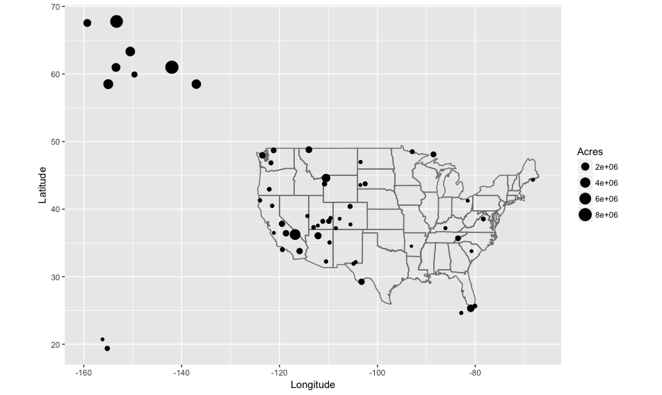
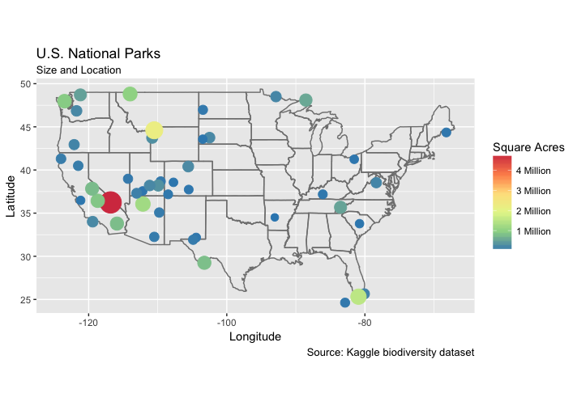
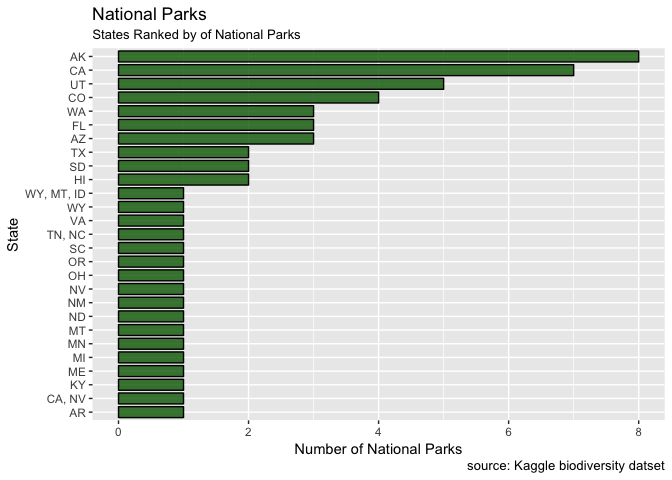
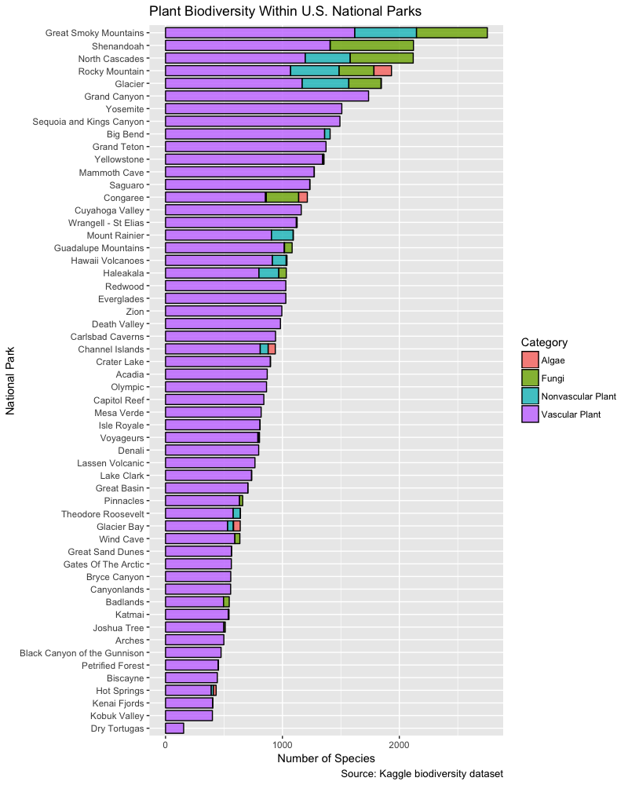
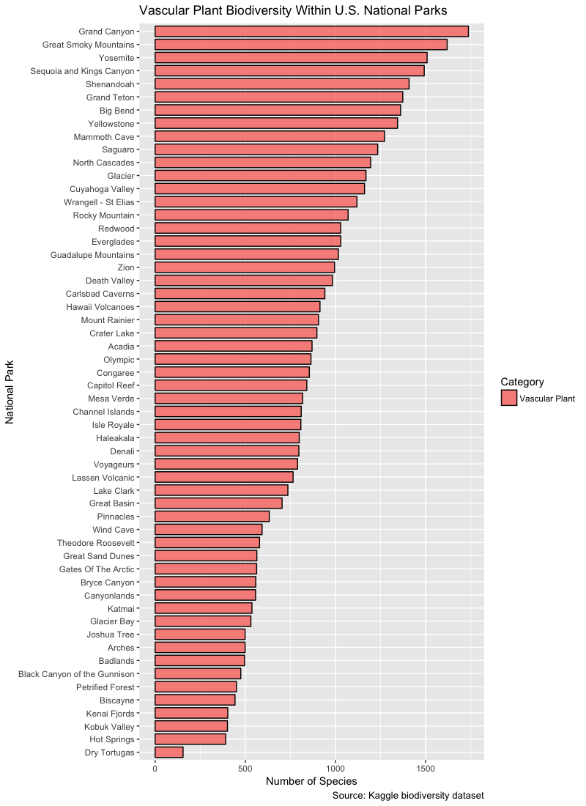
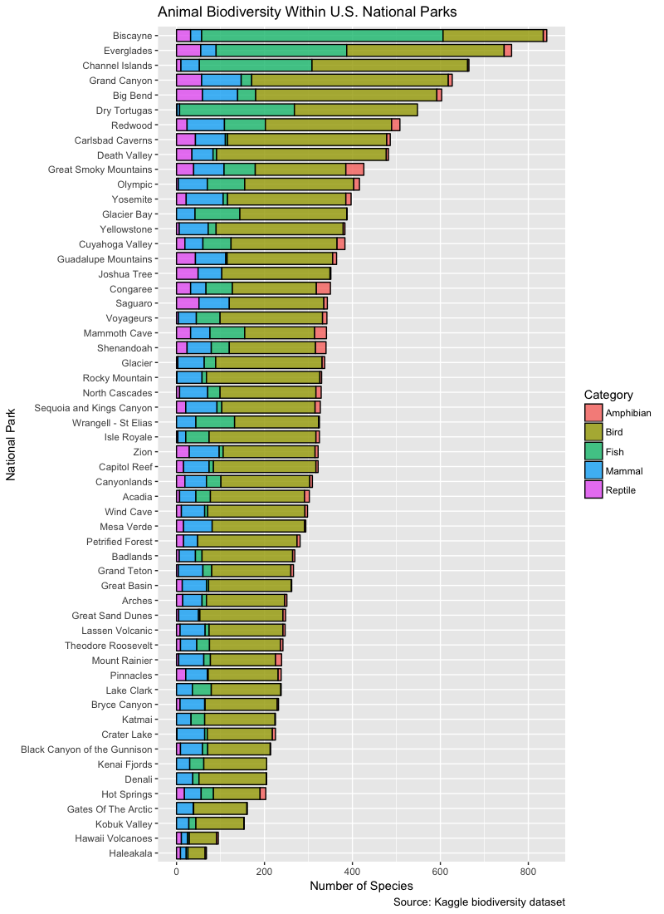
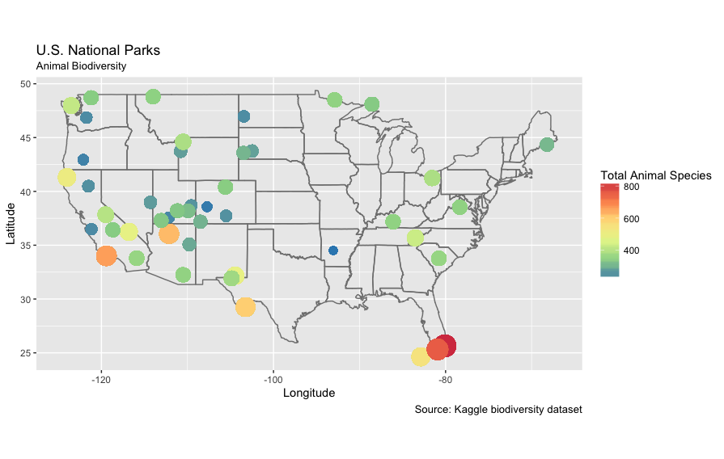

# np_biodiversity

This is a simple exploratory data analysis on the U.S. National Park Biodiversity dataset, sourced from [kaggle](https://www.kaggle.com/nationalparkservice/park-biodiversity/data). I've been using R to investigate scientific problems for a while now, but I'm just starting to use the ggplot2 data visualization package. This is also my first personal data science project with R! I Hope you find it useful none the less.

This analysis explores three simple questions about U.S. National Park Biodiversity:

1. Where are the 58 National Parks, and how big are they?
2. Generally, which parks have the most and least plant and animal diversity?
3. Is there any relationship between a park's size, and biodiversity?

### Setup 

    library('tidyverse')
    library('RColorBrewer')
    library('maps')

Hadley Wickham's tidyverse includes ggplot2, tidyr, and few other great packages to make data science in R easy. I recommend checking out his book [R for Data Science](http://r4ds.had.co.nz/) to learn more. RColorBrewer provides pleasing color palettes, and maps allows for geospatial plots. 

    # setwd("~/Documents/data_science/np_biodiversity")
    parks <- read_csv("input/parks.csv")
    species <- read_csv("input/species.csv")

Here I'm reading in the biodiversity dataset, again the dataset can be downloaded for free [here](https://www.kaggle.com/nationalparkservice/park-biodiversity/data). 

 
### Park Location and Size

    parks_mapped <- parks %>%
      ggplot(aes(Longitude, Latitude)) +
      borders("state") +
      geom_point(aes(size=Acres)) +
      coord_quickmap()
    parks_mapped

This is just a quick peek at the data. I create a new variable called parks_mapped, first copying the parks dataframe into it, then (%>%) calling a ggplot function. The mappings for this function are Longitude on the X axis, Latitude on the Y axis. Calling the build in borders("states") allows for a map to be projected around these points; unfortunately, the borders function doesn't include Alaska and Hawaii. Next the points are plotted with their size according to how large the parks are in square acres. Coordinates are set to retain the maps ratio, and the parks\_map variable finally plotted.  

Let's cut out Alaska and Hawaii, and spruce up this visualization a little bit.

    lower_48_mapped <- parks %>% 
      filter(State != "AK" & State != "HI") %>% 
      ggplot(aes(Longitude, Latitude)) +
      borders("state") +
      geom_point(
        aes(
          size=Acres, 
          color=Acres
        )
      ) +
      coord_quickmap() +   
      labs(title="Continental U.S. National Parks",               
           subtitle="Size and Location",
           caption="source: Kaggle biodiversity dataset"
      ) + 
      scale_size_continuous(
        range=c(3,9),
        guide=FALSE) + 
      scale_colour_distiller(name = "Square Acres",
                             breaks=c(1e+06, 2e+06, 3e+06, 4e+06),
                             labels=c("1 Million", "2 Million", "3 Million", "4 Million"),
                             palette="Spectral")
    lower_48_mapped

To create this map, first filtered out the national parks in Alaska and Hawaii. Then use the same visualization recipe as before, but this time I added in that the color of the points should also be determined by the size of the parks. Next add labels and spruce up the legend and color palette, then plot the new visualization. 

From this visualization, it is evident that most national parks are under 1 million square acres in size. Most parks are located west of the Mississippi River,scattered around Utah, California, and Colorado.

Which states have the most national parks?

    # Create a table of number of national parks per state

    parks_by_state <- parks %>%
      group_by(State) %>%
      summarise(num_of_parks = n()) %>% 
      arrange(desc(num_of_parks)) %>%
      ungroup(parks_by_state)

    # Create a graph to show the same: 
    
    ggplot(parks_by_state) + 
      geom_bar(aes(fct_reorder(State, num_of_parks), num_of_parks),
               stat="identity",
               width = 0.8,                      
               color = "black",                   
               fill = "darkgreen",             
               alpha = 0.8                       
               ) +
      labs(title="National Parks",                          
           subtitle="States Ranked by of National Parks", 
           caption="source: Kaggle biodiversity datset", 
           y = "Number of National Parks",
           x = "State"
      ) + 
      coord_flip()

Alaska earns the title of "state with the most national parks", or does it? If you look closely California appears twice in the graph, once near the top with seven national parks, but again near the bottom combined with Nevada. California has a grand total of 8 national parks, sharing the top spot with Alaska. It appears twice because in the dataset, the variable \`State\` lists all the states that the national park is in. If the park is exclusively found in California, \`State\` returns CA, if the park is found in more than one state, as is the case with Death Valley, it'll return both states: CA, NV. Yellowstone and Great Smokey Mountain national parks both return multiple states as well. 

 

### Plant Biodiversity Within the Parks

 

    # Only include species that are present within the parks
    # Also remove "national park" from each park name, it's redundant

    species_cleaned <- species %>%
      filter(Occurrence == "Present") %>%
      mutate(park_name = str_replace(`Park Name`, " Na.*", ""))

    # Only include species that are algae, fungi, and plants

    plant_biodiv <- species_cleaned %>%
      filter(Category == "Algae" | Category == "Fungi" | Category == "Nonvascular Plant" | Category == "Vascular Plant") %>%
      group_by(park_name) %>%
      mutate(total_div = n())

    # plot the plant biodiversity as a bar chart

    ggplot(plant_biodiv) + 
      geom_bar(
        mapping = aes(x = fct_reorder(park_name, total_div), fill = Category),
        width = 0.8,                       
        color = "black",                 
        alpha = 0.8
      ) + 
      labs(title="Plant Biodiversity Within U.S. National Parks",             
           caption="Source: Kaggle biodiversity dataset", 
           x = "National Park",
           y = "Number of Species"
      ) + 
      coord_flip()

Wow, there's a lot going on here! The majority of every national park's plant population is vascular plants, species of flowers, ferns, trees and shrubs and the like. But that's odd, there's a complete lack of fungi, algae, and non-vascular plants in the majority national parks. Surely this isn't correct. The dataset claims that Olympic National Park, has no plant count other than vascular species, even though the park is partially covered in rainforest. 

Rather than being a source of enlightenment on plant biodiversity, this visualization has shown us flaws in the biodiversity dataset. Perhaps an outcome that is just as valuable. Instead of following the rabbit hole of fixing this dataset, let's just settle with vascular plant biodiversity and re-plot the data based on this category alone. 

    plant_biodiv <- species_cleaned %>%
      filter(Category == "Vascular Plant") %>%
      group_by(park_name) %>%
      mutate(total_div = n())
    plant_biodiv

    ggplot(plant_biodiv) + 
      geom_bar(
        mapping = aes(x = fct_reorder(park_name, total_div), fill = Category),
        width = 0.8,                       
        color = "black",                 
        alpha = 0.8
      ) + 
      labs(title="Vascular Plant Biodiversity Within U.S. National Parks", 
          caption="Source: Kaggle biodiversity dataset", 
          x = "National Park",
          y = "Number of Species"
      ) + 
      coord_flip()

Interesting, Grand Canyon National Park has the highest amount of vascular plant biodiversity amoung the parks. This could be true, but it could also be true that because Grand Canyon has been studied so intensely, they have a more detailed and complete survey of vascular plants than any other park. Other high ranking, and high profile parks such as Yosemite, Sequoia, Grand Teton, and Yellowstone add credence to this hypothesis. 

In any case, it's an interesting visualization that gives you an idea on just how tricky statistics can be. 

 

### Animal Biodiversity Within the Parks

 

    # create dataframe of only present animal species 
    # create a total diversity observation 'total_div'

    animal_biodiv <- species_cleaned %>%
      filter(Category == "Amphibian" | Category == "Reptile" | Category == "Bird" | Category == "Fish" | Category ==  "Mammal") %>%
      group_by(park_name) %>%
      mutate(total_div = n())

    # plot the animal diversity, rank parks by their totals

    ggplot(animal_biodiv) + 
      geom_bar(
        mapping = aes(x = fct_reorder(park_name, total_div), fill = Category), 
        width = 0.8,                       
        alpha = 0.8
      ) + 
      labs(title="Animal Biodiversity Within U.S. National Parks",    
           caption="Source: Kaggle biodiversity dataset", 
           x = "National Park",
           y = "Number of Species"
      ) + coord_flip()

Bird species make up a majority of animal biodiversity in most parks. Parks that are have large bodies of brackish and salt water see large varieties of fish species. Reptiles and amphibians are almost always the clear minority, often times failing to show up on the visualization at all due to their low totals. Mammal biodiversity numbers remain consistent across almost all of the 58 parks. 

I find this visualization much more interesting, and perhaps reliable than the previous vascular plant plots. It's interesting that Dry Tortugas, which had the lowest vascular plant numbers, is among the most biodiverse in terms of animals. I would say that most of the rankings make sense if you take the time to research the park and review the relevance of each animal category that contributes to its total diversity.

 
### Park Biodiversity & Size

    # combine the species data with park data

    animal_biodiv_mapped <- parks %>%
      left_join(animal_biodiv, by = "Park Name")

    # take out hawaii and alaska again

    animal_biodiv_mapped <- animal_biodiv_mapped %>%
      filter(State != "AK" & State != "HI") %>% 
      ggplot(aes(Longitude, Latitude)) +
      borders("state") +
      geom_point(
        aes(
          size=total_div, 
          color=total_div
        )
      ) +
      coord_quickmap() +   
      labs(title="U.S. National Parks",               
           subtitle="Animal Biodiversity",
           caption="source: Kaggle biodiversity dataset"
      ) + 
      scale_size_continuous(
        range=c(3,9),
        guide=FALSE) +
      scale_colour_distiller(name = "Total Animal Species",
                             breaks=c(800, 600, 400, 200, 0),
                             palette="Spectral")
    animal_biodiv_mapped

This is a fun plot, there are a lot of conclusions that can be drawn from it, but perhaps I'll let you make your own. I find the variance of animal species between parks that are geographically close to be interesting, but not highly suspicious. 

We've seen which parks are large, and which parks have a large variety of plants and animals, but do these two variables have anything to do with each other?
 

    # combine park and species dataset again

    animal_bio_corr <- parks %>%
      left_join(animal_biodiv, by = "Park Name") %>%
      select(park_name, Acres, Latitude, Longitude, total_div)
    animal_bio_corr <- unique(animal_bio_corr)

    # create a scatterplot of park size vs animal diversity

    animal_bio_corr %>%
      ggplot(
        aes(total_div,
            Acres
        )
      ) + 
      geom_point(
        color="burlywood4",
        size=4,
        alpha = 0.8
      ) + 
      geom_smooth(method="lm", 
                  color = "black",
                  se = FALSE,
                  linetype="dotted"
      ) + 
      labs(                   
        title="Animal Biodiversity & National Park Area", 
        y="Square Acres", 
        x="Total Number of Animal Species", 
        caption = "source: Kaggle biodiversity dataset"
      )

Plotting the total number of animal species in a park (x-axis) against the area of the park (y-axis) allows for a scatterplot to reveal any trends relating the two. Each park is an individual point on this chart, the trend line is dotted in black. 

Again, it is evident that most parks are not behemoths like Gates of the Arctic and Death Valley; the typical national park is under 500,000 square acres. The number of animal species ranges from about 60, to over 800. There is apparently an inverse relationship between park size and biodiversity. Let's examine this further. 

    # numerically evaluate the relationship between size and biodiversity

    animal_cor_value <- cor.test(animal_bio_corr$Acres, animal_bio_corr$total_div)
    animal_cor_value

    ## 
    ##  Pearson's product-moment correlation
    ## 
    ## data:  animal_bio_corr$Acres and animal_bio_corr$total_div
    ## t = -0.3738, df = 54, p-value = 0.71
    ## alternative hypothesis: true correlation is not equal to 0
    ## 95 percent confidence interval:
    ##  -0.3095684  0.2149692
    ## sample estimates:
    ##         cor 
    ## -0.05080241

A Pearson's correlation test between park size and total animal diversity reports a -0.05 correlation coefficient. The catch is that the p-value is extremely high (0.71) and the confidence interval is also enormous. The null hypothesis is incredibly likely to be true, and thus there is likely no correlation between park size, and animal biodiversity. 

### Summary 

In this short essay we've learned about plant and animal biodiversity in the U.S. National Parks, and the parks themselves. For me, the real learning revolved around the ggplot2 graphing package, communicating geospatial data, rmarkdown, knitr, and the dplyr packages, as well as practice creating a compelling story from code and data.

 In the future I would like to further dissect the mammal, bird, and fish biodiversity within the parks using modelr and the graphing software plotly, and shiny. If you found this analysis interesting, keep an eye out for these!

 Thanks for reading,     
 Fisher
