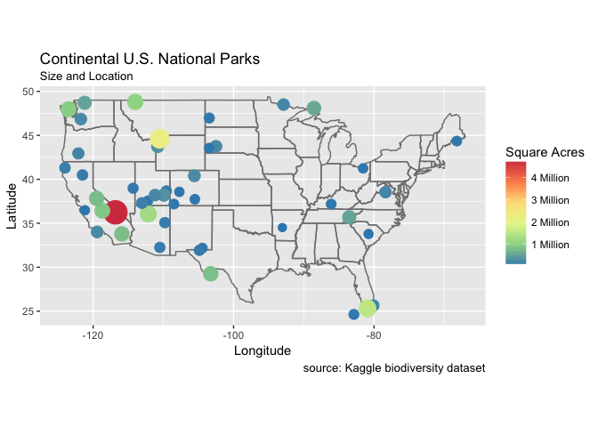
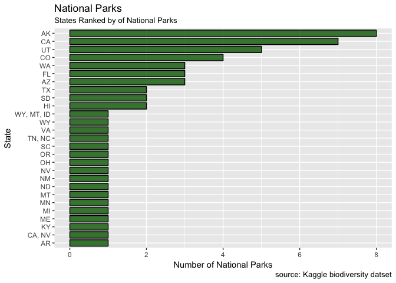
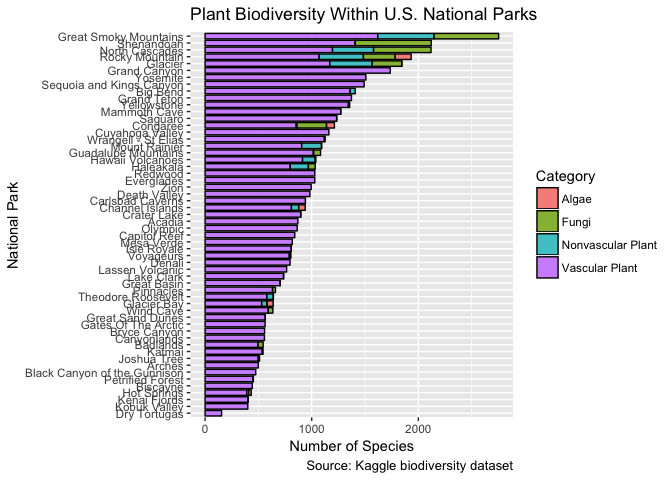
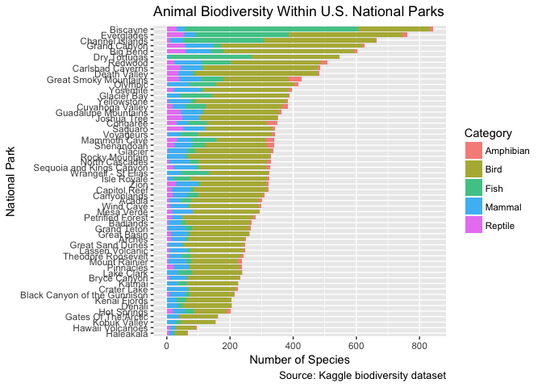
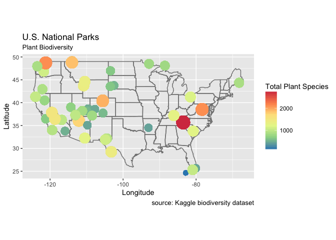
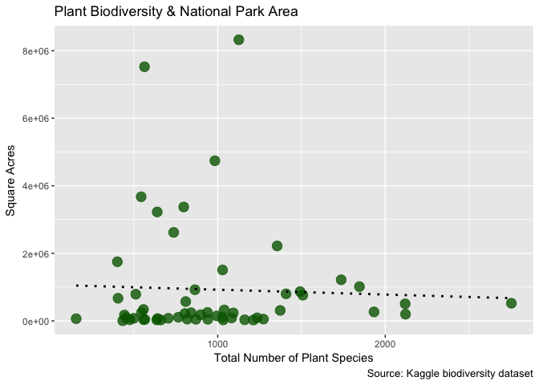
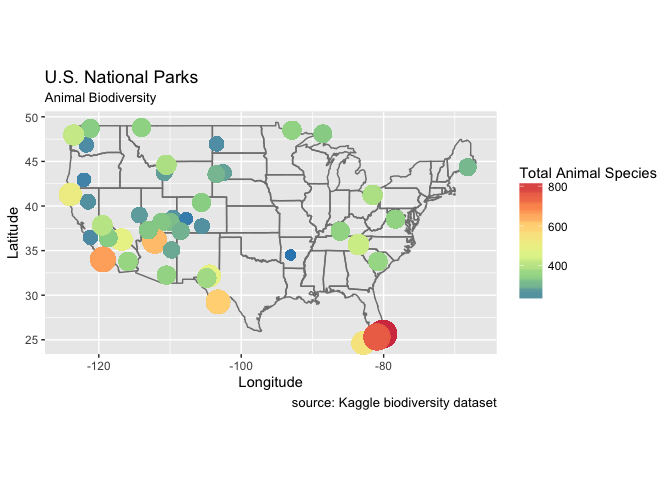
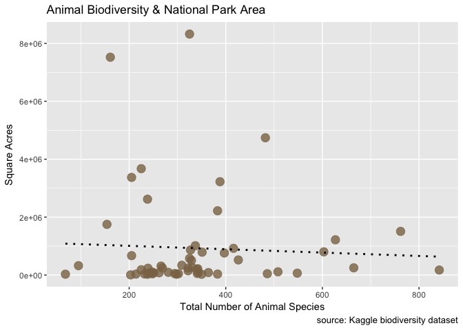

Biodiversity in U.S. National Parks for Github
================
Fisher Ankney
January 18, 2018

This is a simple analysis of the Biodiversity in National Parks dataset, and is coincidentally my first attempt at Data Science. In this project, I explore three simple facets of the dataset:

1.  The geographic distribution and size of the 58 U.S. National Parks
2.  The general plant and animal biodiversity within these parks
3.  Any existing relationship between a parks size and it's biodiversity

<br  />

First let's load the R packages used in the analysis:

``` r
library('tidyverse')
library('RColorBrewer')
library('maps')
```

<br  />

Now we must load the dataset, downloaded from:<br  /> <https://www.kaggle.com/nationalparkservice/park-biodiversity/data>

``` r
setwd("~/Documents/data_science/np_biodiversity")
parks <- read_csv("input/parks.csv")
species <- read_csv("input/species.csv")
```

<br  /> Plotting the locations of the continential national parks and their sizes:

``` r
lower_48_mapped <- parks %>% 
  filter(State != "AK" & State != "HI") %>% 
  ggplot(aes(Longitude, Latitude)) +
  borders("state") +
  geom_point(
    aes(
      size=Acres, 
      color=Acres
    )
  ) +
  coord_quickmap() +   
  labs(title="Continental U.S. National Parks",               
       subtitle="Size and Location",
       caption="source: Kaggle biodiversity dataset"
  ) + 
  scale_size_continuous(
    range=c(3,9),
    guide=FALSE) + 
  scale_colour_distiller(name = "Square Acres",
                         breaks=c(1e+06, 2e+06, 3e+06, 4e+06),
                         labels=c("1 Million", "2 Million", "3 Million", "4 Million"),
                         palette="Spectral")
lower_48_mapped
```

 This map reveals that most continental parks are under 1 million square acres in size. A few exceptionally large parks include Everglades, Yellowstone, Death Valley, Glacier, and Olympic. <br  /> <br  />

Which states have the most national parks?

``` r
# Create a table of number of national parks per state:
parks_by_state <- parks %>%
  group_by(State) %>%
  summarise(num_of_parks = n()) %>% 
  arrange(desc(num_of_parks)) %>%
  ungroup(parks_by_state)

# Create a graph to show the same: 
ggplot(parks_by_state) + 
  geom_bar(aes(fct_reorder(State, num_of_parks), num_of_parks),
           stat="identity",
           width = 0.8,                      
           color = "black",                   
           fill = "darkgreen",             
           alpha = 0.8                       
           ) +
  labs(title="National Parks",                          
       subtitle="States Ranked by of National Parks", 
       caption="source: Kaggle biodiversity datset", 
       y = "Number of National Parks",
       x = "State"
  ) + 
  coord_flip()
```

 Note that Wyoming, Montana, and Idaho are grouped under a single park (Yellowstone), Tennesee and North Carolina are grouped under a single park (Great Smokey Mountains), and California and Nevada are grouped under a single park (Death Valley). The grouped park doesn't double-count towards the individual state's count, so California actually has 8 national parks, Wyoming has 2, Montana has 2, and Nevada has 2.

<br  />

Plant Biodiversity
==================

<br  />

``` r
species_cleaned <- species %>%
  filter(Occurrence == "Present") %>%
  mutate(park_name = str_replace(`Park Name`, " Na.*", ""))

plant_biodiv <- species_cleaned %>%
  filter(Category == "Algae" | Category == "Fungi" | Category == "Nonvascular Plant" | Category == "Vascular Plant") %>%
  group_by(park_name) %>%
  mutate(total_div = n())

ggplot(plant_biodiv) + 
  geom_bar(
    mapping = aes(x = fct_reorder(park_name, total_div), fill = Category),    
    width = 0.8,                       
    color = "black",                 
    alpha = 0.8
  ) + 
  labs(title="Plant Biodiversity Within U.S. National Parks",                        
       caption="Source: Kaggle biodiversity dataset", 
       x = "National Park",
       y = "Number of Species"
  ) + 
  coord_flip()
```



<br  />

Animal Biodiversity
===================

<br  />

``` r
animal_biodiv <- species_cleaned %>%
  filter(Category == "Amphibian" | Category == "Reptile" | Category == "Bird" | Category == "Fish" | Category ==  "Mammal") %>%
  group_by(park_name) %>%
  mutate(total_div = n())

ggplot(animal_biodiv) + 
  geom_bar(
    mapping = aes(x = fct_reorder(park_name, total_div), fill = Category), 
    width = 0.8,                       
    alpha = 0.8
  ) + 
  labs(title="Animal Biodiversity Within U.S. National Parks",                         
       caption="Source: Kaggle biodiversity dataset", 
       x = "National Park",
       y = "Number of Species"
  ) + coord_flip()
```



Plant Biodiversity and National Park Size
=========================================

``` r
plant_biodiv_mapped <- parks %>%
  left_join(plant_biodiv, by = "Park Name")

plant_biodiv_mapped <- plant_biodiv_mapped %>%
  filter(State != "AK" & State != "HI") %>% 
  ggplot(aes(Longitude, Latitude)) +
  borders("state") +
  geom_point(
    aes(
      size=total_div, 
      color=total_div
    )
  ) +
  coord_quickmap() +   
  labs(title="U.S. National Parks",               
       subtitle="Plant Biodiversity",
       caption="source: Kaggle biodiversity dataset"
  ) + 
  scale_size_continuous(
    range=c(3,9),
    guide=FALSE) +
  scale_colour_distiller(name = "Total Plant Species",
                  #       breaks=c(800, 600, 400, 200, 0),
                         palette="Spectral")
plant_biodiv_mapped
```



<br  />

Plant Biodiversity Correlation
==============================

<br  />

``` r
plant_bio_corr <- parks %>%
  left_join(plant_biodiv, by = "Park Name") %>%
  select(park_name, Acres, Latitude, Longitude, total_div)
plant_bio_corr <- unique(plant_bio_corr)

plant_bio_corr %>%
  ggplot(
    aes(total_div,
        Acres
        )
  ) + 
  geom_point(
      color="darkgreen",
      size=4,
      alpha = 0.8
  ) + 
  geom_smooth(method="lm", 
              color = "black",
              se = FALSE,
              linetype="dotted"
  ) + 
  labs(                   
    title="Plant Biodiversity & National Park Area", 
    y="Square Acres", 
    x="Total Number of Plant Species", 
    caption = "Source: Kaggle biodiversity dataset"
  )
```



``` r
plant_cor_value <- cor.test(plant_bio_corr$Acres, plant_bio_corr$total_div)
plant_cor_value
```

    ## 
    ##  Pearson's product-moment correlation
    ## 
    ## data:  plant_bio_corr$Acres and plant_bio_corr$total_div
    ## t = -0.31289, df = 54, p-value = 0.7556
    ## alternative hypothesis: true correlation is not equal to 0
    ## 95 percent confidence interval:
    ##  -0.3020621  0.2228531
    ## sample estimates:
    ##        cor 
    ## -0.0425398

<br  />

Animal Biodiveristy and Park Size
=================================

<br  />

``` r
animal_biodiv_mapped <- parks %>%
  left_join(animal_biodiv, by = "Park Name")

animal_biodiv_mapped <- animal_biodiv_mapped %>%
  filter(State != "AK" & State != "HI") %>% 
  ggplot(aes(Longitude, Latitude)) +
  borders("state") +
  geom_point(
    aes(
      size=total_div, 
      color=total_div
    )
  ) +
  coord_quickmap() +   
  labs(title="U.S. National Parks",               
       subtitle="Animal Biodiversity",
       caption="source: Kaggle biodiversity dataset"
  ) + 
  scale_size_continuous(
    range=c(3,9),
    guide=FALSE) +
  scale_colour_distiller(name = "Total Animal Species",
                         breaks=c(800, 600, 400, 200, 0),
                         palette="Spectral")
animal_biodiv_mapped
```



<br  />

Animal Biodiversity Correlation
===============================

<br  />

``` r
animal_bio_corr <- parks %>%
  left_join(animal_biodiv, by = "Park Name") %>%
  select(park_name, Acres, Latitude, Longitude, total_div)
animal_bio_corr <- unique(animal_bio_corr)

animal_bio_corr %>%
  ggplot(
    aes(total_div,
        Acres
    )
  ) + 
  geom_point(
    color="burlywood4",
    size=4,
    alpha = 0.8
  ) + 
  geom_smooth(method="lm", 
              color = "black",
              se = FALSE,
              linetype="dotted"
  ) + 
  labs(                   
    title="Animal Biodiversity & National Park Area", 
    y="Square Acres", 
    x="Total Number of Animal Species", 
    caption = "source: Kaggle biodiversity dataset"
  )
```



``` r
animal_cor_value <- cor.test(animal_bio_corr$Acres, animal_bio_corr$total_div)
animal_cor_value
```

    ## 
    ##  Pearson's product-moment correlation
    ## 
    ## data:  animal_bio_corr$Acres and animal_bio_corr$total_div
    ## t = -0.3738, df = 54, p-value = 0.71
    ## alternative hypothesis: true correlation is not equal to 0
    ## 95 percent confidence interval:
    ##  -0.3095684  0.2149692
    ## sample estimates:
    ##         cor 
    ## -0.05080241

Summary:
--------
